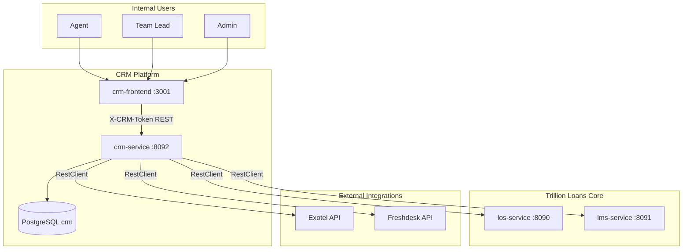
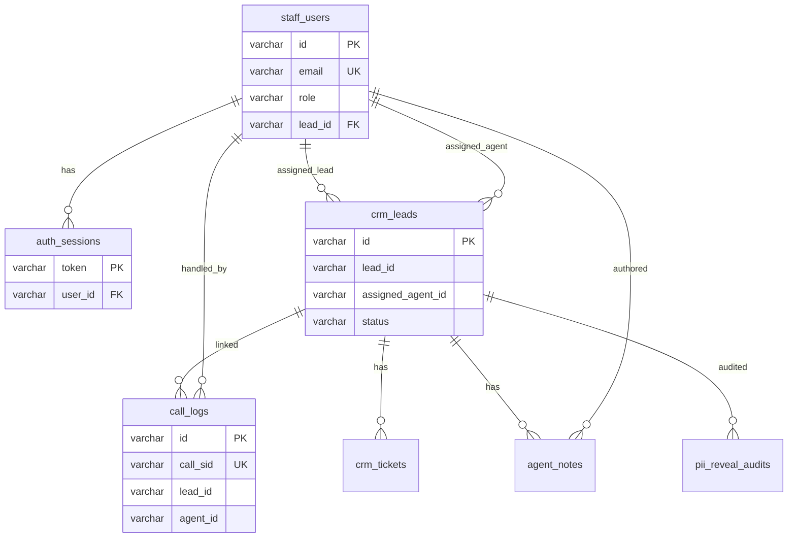
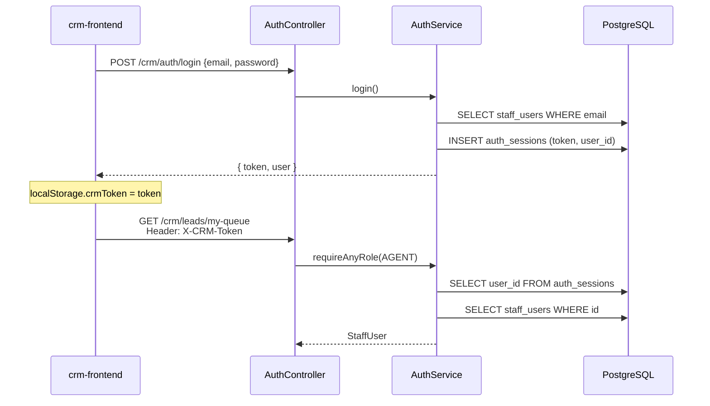

# CRM Loan Operations Platform — Architecture Document

> **Scope:** Internal CRM for collections / loan operations teams (Agent, Lead, Admin roles).  
> **Last updated:** June 2026 (post WebFlux → MVC migration, PostgreSQL persistence)

---

## 1. High-Level Design (HLD)

### 1.1 Purpose

The CRM is a **Backend-for-Frontend (BFF)** that gives internal staff a single workspace to:

- Manage customer follow-up queues (CRM leads)
- View customer 360° (profile, loans, tickets, calls, notes)
- Handle Freshdesk support tickets and IVR/Exotel call history
- Provide admin/lead oversight (ops metrics, reassignment, integrations health)

It **does not** replace LOS (origination) or LMS (servicing). It **aggregates** data from them plus third-party systems (Exotel, Freshdesk).

### 1.2 System Context



### 1.3 Deployment Topology

| Component | Port | Runtime | Database |
|-----------|------|---------|----------|
| `crm-frontend` | 3001 | Next.js 14 (Node) | — |
| `crm-service` | 8092 | Spring Boot 3.3 (Tomcat) | Dedicated `crm` PostgreSQL |
| `los-service-main` | 8090 | Spring Boot 3.3 WebFlux | Shared `trillion` PostgreSQL (R2DBC) |
| `lms-service-main` | 8091 | Spring Boot 3.2 WebFlux | Shared `trillion` PostgreSQL (R2DBC) |

**Local dev:** `docker compose up -d` in `crm-service/` starts Postgres on **5433**.  
**Production:** Ops applies `schema.sql` to a managed `crm` database; env vars `CRM_DB_URL`, `CRM_DB_USER`, `CRM_DB_PASSWORD`.

### 1.4 Role-Based Access

| Role | Frontend route | Primary capabilities |
|------|----------------|---------------------|
| **AGENT** | `/agent` | My queue, customer workspace, Support (Freshdesk), IVR calls, workflow |
| **LEAD** | `/lead` | Team queue, bucket stats, reassignment, resolution rates |
| **ADMIN** | `/admin` | Ops overview, ticket explorer, user management, integrations health |

Auth: email + password (MVP) → UUID token stored in `auth_sessions`, sent as `X-CRM-Token` header.

### 1.5 Major Data Flows

#### Customer 360 (Agent selects a lead)

```
Agent UI → GET /crm/customers/{leadId}/dashboard
         → CustomerSummaryService + DashboardService
         → CrmStore (tickets, notes, calls)
         → ExternalDataService → LOS profile + LMS loans (RestClient)
         → FreshdeskTicketService (optional live tickets)
```

#### Lead ingestion & round-robin

```
POST /crm/leads/ingest
  → CrmStore.ingestLead()
  → SELECT active agents → crm_assignment_state round-robin cursor
  → INSERT crm_leads (ASSIGNED or NEW)
```

#### Exotel daily sync (scheduled)

```
@Scheduled cron → ExotelCallSyncService.syncPreviousDay()
  → RestClient GET Exotel Calls API (paginated)
  → CrmStore.upsertCallBySid() → call_logs table
```

#### IVR overview (GreyLabs bot escalations)

```
GET /crm/ivr/overview
  → IvrOverviewService
  → call_logs + crm_leads + Freshdesk ticket correlation
  → PiiMaskingService on mobile numbers
```

### 1.6 Non-Functional Characteristics

| Concern | Current state |
|---------|---------------|
| **Scale** | Internal ops tool; blocking MVC suitable for moderate concurrency |
| **Availability** | Depends on LOS/LMS for live customer data; falls back to mock data |
| **Security** | Header token auth; PII reveal audited; mobile masked in IVR |
| **Persistence** | PostgreSQL; CRM-owned tables only |
| **Observability** | Actuator health; SLF4J logging (no OTel/Kafka yet) |

---

## 2. Low-Level Design (LLD)

### 2.1 Backend Package Structure

```
com.trillionloans.crm/
├── CrmApplication.java          @EnableScheduling, @EnableTransactionManagement
├── config/
│   ├── CorsConfig.java          WebMvcConfigurer — CORS for localhost:3001
│   └── RestClientConfig.java    RestClient.Builder bean
├── controller/                  10 REST controllers, ~40 endpoints
├── service/                     Business logic + CrmStore (JDBC repository)
├── repository/
│   └── CrmRowMappers.java       JDBC RowMapper definitions
├── model/
│   ├── CrmModels.java           Domain records + enums
│   └── WrapperModels.java       ApiResponse envelope, loan detail DTOs
└── integration/
    ├── los/                     LosLeadProfileDto, LosLoanApplicationDto, …
    ├── lms/                     LmsLoanDetailsDto, LmsRpsWithDpdDto, …
    ├── LoanStatusMapper.java
    └── ProductNameMapper.java
```

### 2.2 Controller → Service Map

| Controller | Base path | Key services |
|------------|-----------|--------------|
| `AuthController` | `/crm/auth` | `AuthService` |
| `LeadController` | `/crm` | `CrmStore`, `ExternalDataService` |
| `CustomerController` | `/crm/customers/{leadId}` | `DashboardService`, `CustomerSummaryService`, `PiiRevealService`, `CrmStore` |
| `CustomerLookupController` | `/crm/customers` | `CustomerSummaryService` |
| `LoanController` | `/crm/customers/{leadId}/loans/{lan}` | `LoanAggregationService` |
| `CallController` | `/crm` | `CrmStore`, `ExotelCallSyncService` |
| `FreshdeskTicketController` | `/crm/freshdesk/tickets` | `AgentFreshdeskTicketService` |
| `IvrController` | `/crm/ivr` | `IvrOverviewService` |
| `AdminController` | `/crm/admin/users` | `CrmStore` |
| `AdminOpsController` | `/crm/admin/ops` | `AdminOpsService` |

### 2.3 Persistence Layer (CrmStore)

`CrmStore` is the central JDBC repository (`JdbcTemplate`). It replaces the former in-memory `ConcurrentHashMap` implementation.

**Tables:**

| Table | Domain record | Notes |
|-------|---------------|-------|
| `staff_users` | `StaffUser` | ADMIN / LEAD / AGENT hierarchy |
| `auth_sessions` | — | Token → user_id mapping |
| `crm_leads` | `CrmLead` | Ops queue items linked to LOS lead_id |
| `crm_tickets` | `TicketSummary` | Local + synced ticket summaries |
| `call_logs` | `CallEvent` | Exotel + manual + IVR calls |
| `agent_notes` | `AgentNote` | Disposition notes per lead |
| `pii_reveal_audits` | `PiiRevealAudit` | Compliance audit trail |
| `crm_assignment_state` | — | Round-robin cursor for lead ingest |

**Schema files:**

- Bootstrap: `crm-service/src/main/resources/schema.sql`
- Dev seed: `crm-service/src/main/resources/db/seed_data.sql`
- Local profile auto-init: `application-local.yml` → `spring.sql.init`

### 2.4 Entity Relationship Diagram



### 2.5 API Surface (grouped)

#### Auth
| Method | Path | Response |
|--------|------|----------|
| POST | `/crm/auth/login` | `{ token, user }` |
| POST | `/crm/auth/logout` | void |
| GET | `/crm/auth/me` | `StaffUser` |

#### Queues & search
| Method | Path | Roles |
|--------|------|-------|
| GET | `/crm/leads/my-queue` | AGENT |
| GET | `/crm/leads/team-queue` | LEAD, ADMIN |
| POST | `/crm/leads/ingest` | LEAD, ADMIN |
| POST | `/crm/leads/{id}/assign` | LEAD, ADMIN |
| PATCH | `/crm/leads/{id}/status` | AGENT+ |
| GET | `/crm/search?q=` | AGENT+ |

#### Customer 360
| Method | Path | Response style |
|--------|------|----------------|
| GET | `/crm/customers/{leadId}/dashboard` | Raw composite |
| GET | `/crm/customers/{leadId}/profile` | `ApiResponse<T>` |
| GET | `/crm/customers/{leadId}/summary` | `ApiResponse<T>` |
| POST | `/crm/customers/{leadId}/reveal` | `ApiResponse<T>` + audit |
| GET | `/crm/customers/{leadId}/loans/{lan}/details` | `ApiResponse<T>` |

#### Admin ops
| Method | Path |
|--------|------|
| GET | `/crm/admin/ops/overview` |
| GET | `/crm/admin/ops/teams` |
| GET | `/crm/admin/ops/agents` |
| GET | `/crm/admin/ops/tickets` |
| GET | `/crm/admin/ops/health` |

### 2.6 Integration Layer

All outbound HTTP uses **Spring RestClient** (blocking, servlet-thread safe).

| Service | Target | Key endpoints |
|---------|--------|---------------|
| `ExternalDataService` | LOS :8090 | `/partners/api/v1/lead/cp/{id}`, `/lead/info/{mobile}` |
| `ExternalDataService` | LMS :8091 | `/partners/api/v1/collection/{leadId}/loan/details` |
| `LosIntegrationService` | LOS | `/lead/{id}/details` (applications) |
| `LmsIntegrationService` | LMS | RPS+DPD, transactions, foreclosure, due-as-on-date |
| `ExotelCallSyncService` | Exotel | `/v1/Accounts/{sid}/Calls.json` |
| `FreshdeskTicketService` | Freshdesk | `/api/v2/search/tickets`, reply, update |

**Headers to LOS:** `productCode: bharatpe` (configurable via `CRM_PRODUCT_CODE`).

### 2.7 Auth Sequence



### 2.8 Frontend Architecture

```
crm-frontend/src/
├── app/                         Next.js 14 App Router
│   ├── layout.tsx               SessionProvider + AppShell
│   ├── login/page.tsx           Demo login cards
│   ├── agent/page.tsx           → AgentDashboard
│   ├── lead/page.tsx            → LeadOversight
│   └── admin/page.tsx           Tabbed admin shell
├── components/                  All 'use client'
│   ├── app-shell.tsx            Nav + role guard
│   ├── session-provider.tsx     Token bootstrap via /crm/auth/me
│   ├── agent-dashboard.tsx      Queue + customer workspace
│   ├── agent-ivr-overview.tsx   IVR tab
│   ├── agent-freshdesk-bucket.tsx
│   ├── lead-oversight.tsx
│   ├── admin-ops-overview.tsx
│   └── admin-ticket-explorer.tsx
└── lib/
    ├── api.ts                   Axios client + X-CRM-Token interceptor
    └── types.ts                 Mirrors backend DTOs
```

**Data fetching:** Manual `useEffect` + `useState` per component (no React Query).

---

## 3. Tech Stack Comparison (Updated)

### 3.1 Summary Matrix

| Dimension | LOS | LMS | CRM (current) | Customer Portal |
|-----------|-----|-----|---------------|-----------------|
| **Language** | Java 17 | Java 17 | Java 17 | TypeScript 5 |
| **Spring Boot** | 3.3.11 | 3.2.4 | **3.3.11** | — |
| **Web stack** | WebFlux (reactive) | WebFlux (reactive) | **Spring MVC (servlet)** | Next.js 14 |
| **HTTP server** | Netty | Netty | **Tomcat** | Node |
| **DB access** | R2DBC | R2DBC | **JDBC** | — (calls BFF) |
| **Database** | `trillion` (shared) | `trillion` (shared) | **`crm` (dedicated)** | — |
| **Schema mgmt** | Manual SQL | Manual SQL | **Manual SQL** ✓ | — |
| **Outbound HTTP** | WebClient (Mono/Flux) | WebClient | **RestClient (blocking)** | Axios |
| **Auth** | partnerId header filter | partnerId header filter | X-CRM-Token (manual) | authToken localStorage |
| **Caching** | Redis + Caffeine | Redis + Caffeine | None | — |
| **Messaging** | Kafka + SQS | Kafka | None | — |
| **Observability** | OTel + MDC + Kafka logs | OTel + MDC | Actuator + SLF4J | Coralogix browser |
| **Tests** | ~36 test classes | ~15 + JaCoCo gates | **0** | ESLint only |
| **Frontend** | — | — | Next 14 + React 18 | Next 14 + React 18 |
| **CSS** | — | — | Global CSS | SCSS modules |

### 3.2 Alignment Score (post-migration)

| Dimension | Score | Notes |
|-----------|-------|-------|
| Languages & frameworks | **High** | Same Java 17, Spring Boot 3.3, Next 14 |
| Org conventions | **High** | `com.trillionloans.*`, snake_case SQL, manual schema |
| Architecture role | **High** | BFF aggregating LOS/LMS — correct pattern |
| Web/reactive model | **Intentional divergence** | CRM uses MVC; LOS/LMS use WebFlux — appropriate for internal blocking BFF |
| DB technology | **Medium** | Both PostgreSQL; CRM uses JDBC vs R2DBC |
| API contract style | **Medium** | CRM mixed raw + ApiResponse; LOS/LMS use ResponseDTO |
| Production maturity | **Medium-low** | No tests, no OTel, no Redis; schema ready for prod |
| Frontend structure | **Medium** | Same Next/axios stack; simpler CSS than portal |

### 3.3 What Is Now Aligned (vs pre-migration)

| Before | After |
|--------|-------|
| WebFlux starter + blocking code | **Spring MVC** — stack matches usage |
| WebClient + `.block()` on reactor threads | **RestClient** — no reactor warnings |
| In-memory CrmStore (data lost on restart) | **PostgreSQL** with portable `schema.sql` |
| Partial unwired `call_logs.sql` | Full schema + seed + docker-compose |
| Auth tokens in memory | **`auth_sessions` table** |

### 3.4 Remaining Gaps vs LOS/LMS Production Bar

1. **No `@RestControllerAdvice`** — LOS/LMS have `GlobalExceptionHandler`
2. **No Spring Security / WebFilter** — auth checked manually per controller method
3. **Mixed API envelopes** — customer endpoints use `ApiResponse<T>`; ops endpoints return raw DTOs
4. **No test coverage** — LMS enforces JaCoCo minimums
5. **No observability stack** — missing OTel, MDC filters, request logging to Kafka
6. **No Redis cache** — LOS/LMS cache partner master and hot reads
7. **Frontend** — global CSS vs portal SCSS; no Coralogix SDK

### 3.5 Recommended Convergence Roadmap

| Priority | Item | Effort |
|----------|------|--------|
| P1 | Add `GlobalExceptionHandler` + unified `ResponseDTO` | Low |
| P1 | Auth `WebFilter` for `X-CRM-Token` | Low |
| P2 | Unit tests for `CrmStore`, `AuthService`, key services | Medium |
| P2 | Helm `values.yaml` DB config (mirror LOS/LMS) | Low |
| P3 | OTel + MDC (copy from LOS) | Medium |
| P3 | Frontend SCSS module split | Medium |

---

## 4. Configuration Reference

### Environment variables (crm-service)

| Variable | Default | Purpose |
|----------|---------|---------|
| `CRM_DB_URL` | `jdbc:postgresql://localhost:5432/crm` | PostgreSQL JDBC URL |
| `CRM_DB_USER` | `postgres` | DB username |
| `CRM_DB_PASSWORD` | `postgres` | DB password |
| `SPRING_PROFILES_ACTIVE` | — | Set `local` for schema+seed auto-init |
| `LOS_SERVICE_BASE_URL` | `http://localhost:8090` | LOS integration |
| `LMS_SERVICE_BASE_URL` | `http://localhost:8091` | LMS integration |
| `CRM_PRODUCT_CODE` | `bharatpe` | LOS productCode header |
| `CRM_USE_LIVE_DATA` | `true` | Fall back to mock if false or upstream fails |
| `EXOTEL_*` | — | Exotel sync credentials |
| `FRESHDESK_*` | — | Freshdesk API credentials |

### Local startup

```bash
# 1. Postgres
cd crm-service && docker compose up -d

# 2. Backend
SPRING_PROFILES_ACTIVE=local mvn spring-boot:run

# 3. Frontend
cd crm-frontend && npm run dev
```

---

## 5. Glossary

| Term | Meaning |
|------|---------|
| **Lead (LOS)** | Customer identifier in origination system (`lead_id`) |
| **CRM lead** | Ops queue item (`crm_leads.id`) referencing a LOS `lead_id` |
| **LAN** | Loan Account Number (LMS) |
| **BFF** | Backend-for-Frontend — API tailored for a specific UI |
| **IVR** | Interactive Voice Response — GreyLabs AI bot via Exotel |
| **Round-robin** | Automatic agent assignment on lead ingest |
