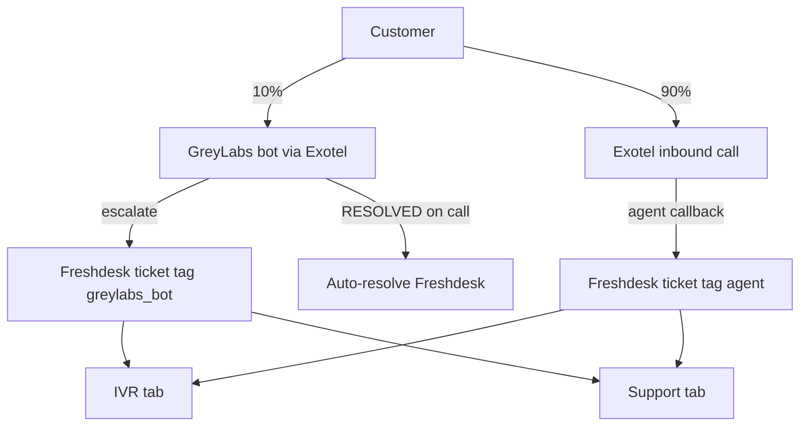

# CRM R1 — Product Requirements (R1)

## Overview

R1 simplifies the agent workspace, introduces field-specific customer search, moves Freshdesk sync to the Support tab, and defines the GreyLabs (10%) + Exotel inbound (90%) call funnel with tagged Freshdesk tickets.

## Call funnel



| Rule | Detail |
|------|--------|
| GreyLabs path | Bot calls via Exotel; escalation creates Freshdesk ticket with tag `greylabs_bot` |
| Inbound path | Exotel inbound → agent callback → ticket tag `agent` |
| Bot auto-resolve | Disposition `RESOLVED` + source GreyLabs → Freshdesk status 4 (resolved) |
| Ticket visibility | Tags or `cf_source_channel` = `greylabs_bot` \| `agent` |
| Calls without tickets | `freshdesk_ticket_id` nullable on `call_logs` |

## Workspace (landing)

- **No** assigned-ticket queue on landing (`GET /crm/leads/my-queue` removed from workspace)
- Field-specific search only (no fuzzy `/crm/search` on landing)
- **Inbound only** opener: registered mobile → LOS profile; unregistered → empty state
- **No** CRM lead auto-ingest for unknown mobiles
- **No** header status pill or working-ticket block

## API: Field-specific search

```
GET /api/v1/crm/search?field={field}&value={value}
```

| field | value format | behaviour |
|-------|--------------|-----------|
| `mobile` | 10 digits | LOS mobile lookup |
| `leadId` | 6–12 digits | LOS profile by leadId |
| `lan` | LAN pattern | LMS/CRM LAN → leadId + highlight LAN |
| `la` | LA pattern | LOS application → leadId |
| `email` | email | Freshdesk + LOS; ties email-only tickets |

Response:

```json
{
  "leadId": "1002001",
  "clientId": "C1002001",
  "matchedField": "mobile",
  "matchedValue": "9999999999",
  "highlightLoanAccountNumber": "LAN-900001",
  "customerFound": true,
  "displayName": "Rahul Mehta · 9999999999",
  "mobileNumber": "9999999999"
}
```

Legacy `GET /crm/search?query=` is **deprecated** (still available for admin/ops).

## Support tab

| Item | Decision |
|------|----------|
| Sync | Auto on tab open + page reload (no primary Sync button) |
| Source of truth | Freshdesk |
| Comments | Row shows count; click expands full thread via `GET /crm/freshdesk/tickets/{id}/conversations` |
| Deep link | Open in Freshdesk → `{FRESHDESK_BASE_URL}/a/tickets/{id}` |
| Email tickets | Link customer action sets `cf_lead_id` + `cf_mobile` |

## IVR tab

| Item | Decision |
|------|----------|
| Default view | **Assigned** — agent's calls or tickets, last **24 hours** |
| Second tab | **Not assigned** — triage queue |
| Source filter UI | **Removed** — read-only GreyLabs vs Agent/Inbound badge |
| Row fields | leadId, clientId, mobile, lan, email, assignedAgent, ticketId, disposition, callSource |

## Activity tab (R1)

Customer Activity shows **calls + tickets only** (notes excluded from timeline).

## Schema

`call_logs` additions:

- `source_channel` — `greylabs_bot` \| `agent`
- `freshdesk_ticket_id` — nullable link to Freshdesk ticket

## Jira epics (link when created)

- CRM-R1-SEARCH — Field-specific search API + workspace UI
- CRM-R1-SUPPORT — Freshdesk auto-sync, conversations, channel tags
- CRM-R1-FUNNEL — GreyLabs/Exotel ticket tagging + auto-resolve
- CRM-R1-IVR — Assigned/unassigned triage + 24h window

## Open items

- Confirm Freshdesk custom fields in prod: `cf_lead_id`, `cf_mobile`, `cf_loan_account_number`, `cf_source_channel`
- Confirm GreyLabs resolution webhook vs CRM disposition inference
- Confirm LAN regex per partner (BharatPe ML, etc.)
- Legal/PII scope for email search
